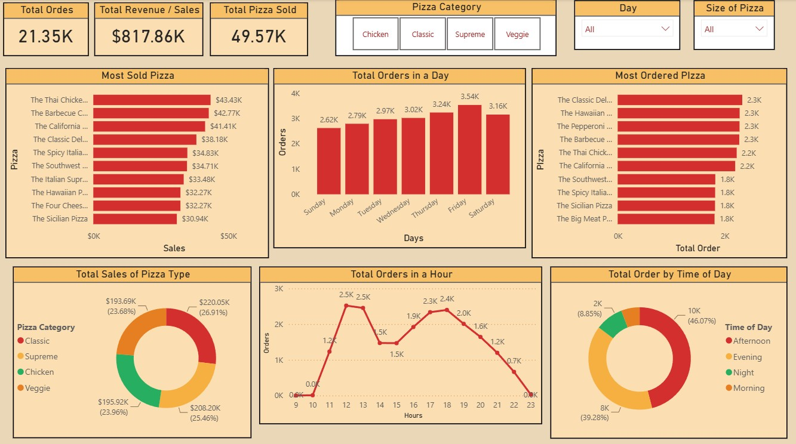

# Pizza Sales Analysis Dashboard

A Power BI dashboard developed to analyze pizza sales performance and customer ordering patterns. The project demonstrates data transformation using Power Query, data modeling, DAX calculations, and interactive dashboard design.

## Dashboard Preview

## Project Objectives

The dashboard was created to answer the following business questions:

1. Identify the hours with the highest and lowest order volumes.
2. Identify which day of the week receives the most orders.
3. Analyze total sales.
4. Identify the most ordered pizza.
5. Identify the pizza generating the highest sales.
6. Identify which time of day receives the most orders.
7. Identify the best-selling pizza category.

## Tools & Technologies

- Power BI Desktop
- Power Query
- DAX
- Data Modeling
- CSV

## Data Preparation

The dataset was transformed and prepared using Power Query.

Key transformation steps included:

- Correcting data types
- Cleaning and transforming columns
- Creating date and time-related fields
- Creating the order hour field
- Creating a Date table
- Merging pizza price information with order details
- Creating the Sales column using quantity and price
